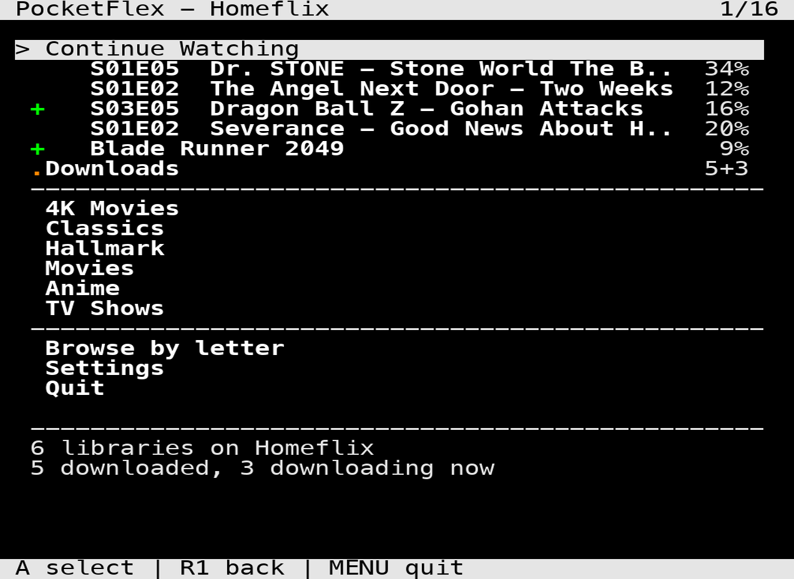
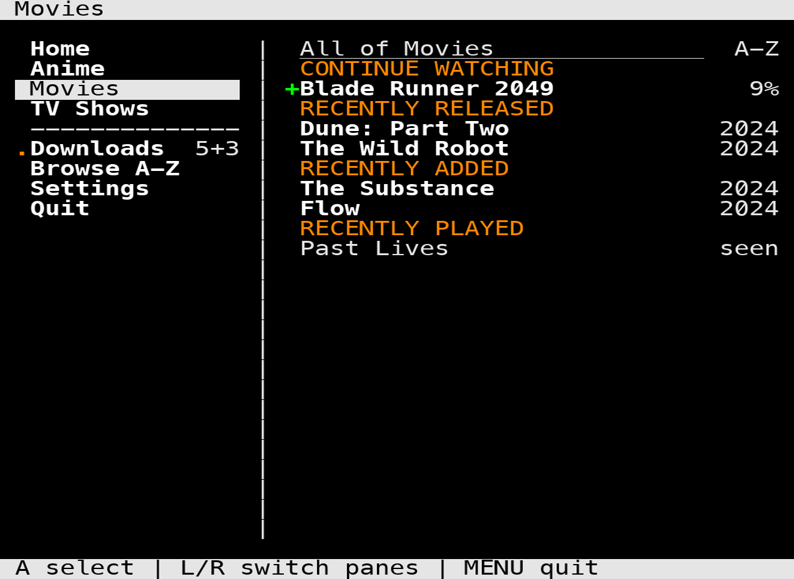
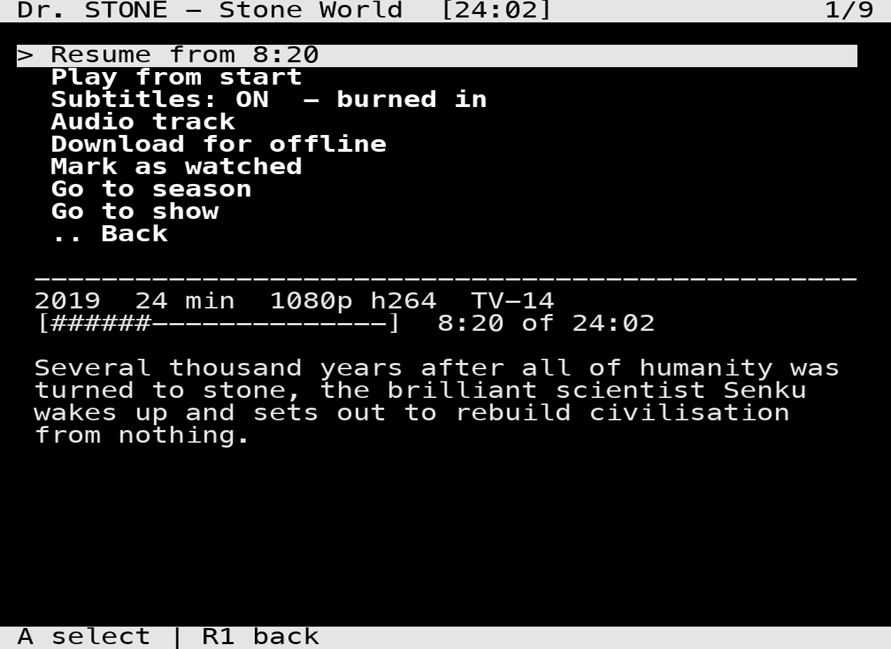
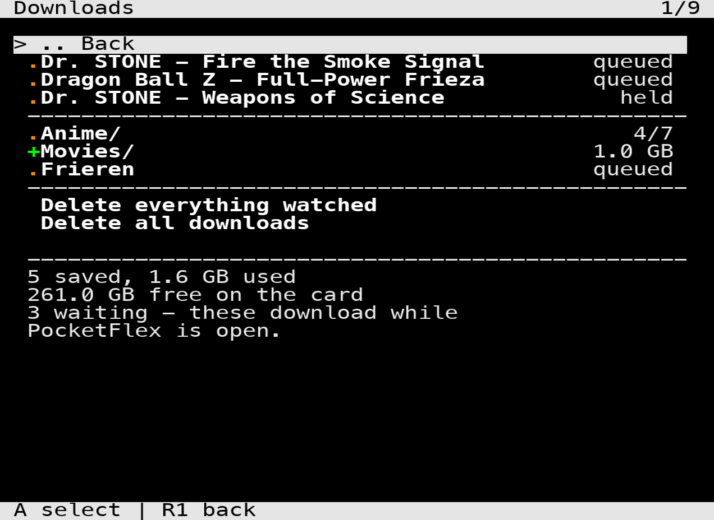
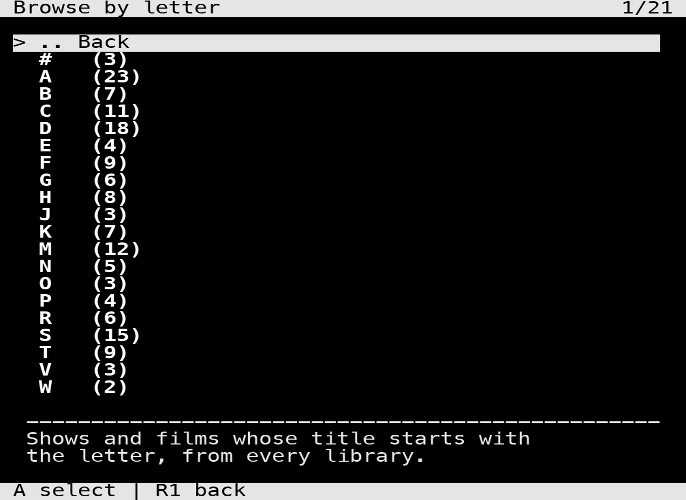
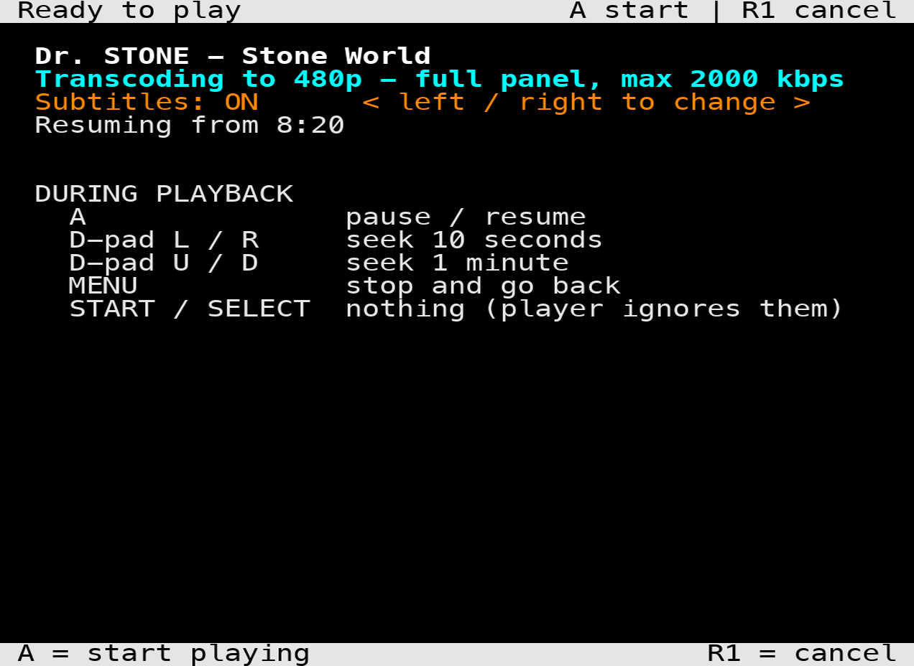
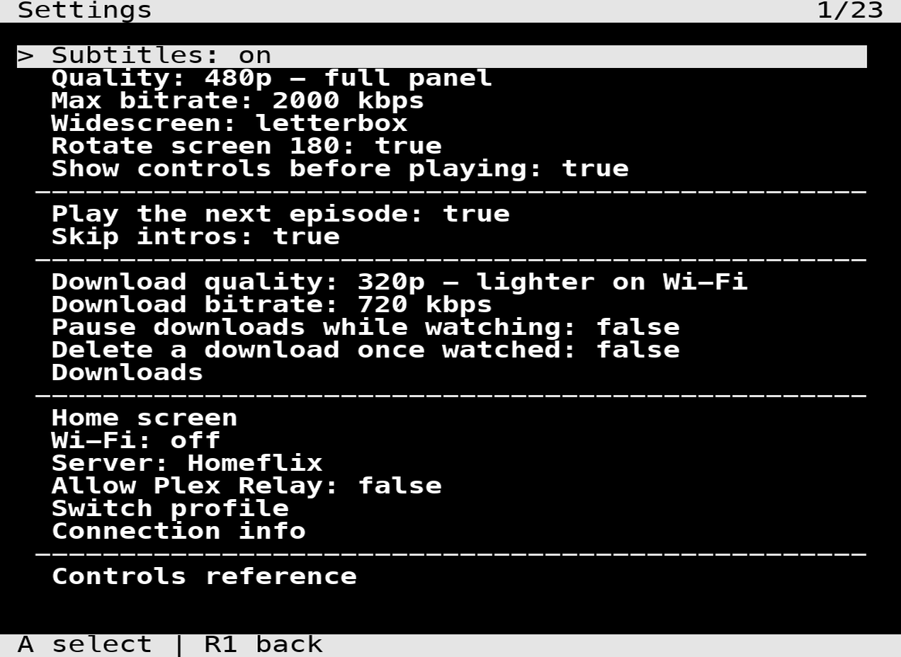

# PocketFlex

A Plex client for the **Miyoo Mini Plus** running **OnionOS**.

It browses your libraries the same way you browse ROMs, and hands playback to
the `ffplay` that's already on the card. No artwork, no grid, no launcher — just
lists, which is the only thing that stays fast on 128 MB of RAM.



You can also save films and episodes to the SD card and watch them with the
Wi-Fi switched off, which is really the reason to want this on a handheld at
all.

---

## What you need

- A **Miyoo Mini Plus**. The Wi-Fi is not optional, so the original Mini won't
  work.
- **OnionOS**. Built and tested against 4.3.1.
- A Plex server you can reach, and an account to sign into.

Nothing gets compiled and nothing gets installed onto the firmware. PocketFlex
is shell scripts calling binaries OnionOS already ships (`st`, `ffplay`, `curl`,
`jq`), so there's nothing to undo if you don't like it — delete the folder and
it's gone.

## Install

1. Download `PocketFlex-v0.4.3.zip` from the
   [latest release](../../releases/latest).
2. Power the handheld off and put the SD card in your computer.
3. Unzip it. You'll get a folder called `PocketFlex`.
4. Copy that folder into the **`App`** folder on the card, so you end up with:

   ```
   /App/PocketFlex/config.json
   /App/PocketFlex/launch.sh
   /App/PocketFlex/lib/
   /App/PocketFlex/res/
   ```

5. Eject the card properly, put it back in, and boot up.
6. PocketFlex is under **Apps** in the Onion menu.

> **Keep the folder named `PocketFlex`.** The menu icon is referenced by full
> path, so renaming the folder gives you an app with a blank icon.

That's the whole install. If you're on a Mac or Linux box and would rather not
drag folders around, `tools/deploy.sh /Volumes/YOURCARD` does the same thing and
won't touch anything else on the card.

### Signing in

First launch shows a four-character code. Go to
[plex.tv/link](https://plex.tv/link) on your phone or computer, type the code
in, and the handheld picks it up within a few seconds. The token is saved to the
card, so you only do this once.

If the account has multiple profiles you'll get a chooser next, PIN pad and all.

## Controls

| Button | What it does |
|---|---|
| **D-pad ↑ ↓** | Move |
| **D-pad ← →**, **L2 / R2** | Jump A–Z in long lists, page otherwise |
| **D-pad ← →** on the home screen | Switch between the sidebar and the rows |
| **D-pad ← →** on *Ready to play* | Subtitles on / off |
| **A**, **START** | Select |
| **R1**, **SELECT** | Back |
| **MENU** | Quit |

### Why B doesn't go back

This one catches everybody, so it's worth saying up front: **B, X, Y and SELECT
are wired to bare modifier keys** on this device (LCTRL, LSHIFT, LALT, RCTRL). A
terminal receives nothing at all when you press a bare modifier — not a key, not
a byte. There's no binding to fix, because nothing arrives.

Back is on **R1** and **SELECT** instead, both of which do send something
(backspace and tab). Every list also keeps a `.. Back` row, so you're never
stuck. If you want to check what your own unit sends, there's a button test in
Settings that prints the raw byte for whatever you press.

This is the same reason the existing OnionOS Jellyfin client documents its back
button as not working. It's the device, not the app.

## What it looks like

Pick a library and the sidebar stays put. You get that library's own rows, the
ones your server already builds for the official clients.



Anything you open gives you the same card: resume, subtitles, audio track, and
the option to save it for offline.



Downloads are filed in the folders you found them in, and folders carry their
own totals.



Long libraries get a letter index instead of a very long scroll.



Before anything plays you get a card telling you what's about to happen and what
the buttons do once it starts.



And the settings, most of which you'll never need to touch.



## Downloads

Save a film, an episode, or a whole season, then watch it with the radio off. If
the server can't be reached at startup, PocketFlex opens on your downloads
rather than giving up.

| Where | What you get |
|---|---|
| An item | Download for offline |
| A season or show | Download everything not already saved |
| The Downloads screen | Browse, play, delete, cancel, clear out watched |

A 24-minute episode came out at 53 MB and took 26 seconds to pull down. They're
transcoded on the way in, not copied — the original would neither fit on the
card nor decode on this chip.

Two things to know before relying on it:

- **Downloads only run while PocketFlex is open.** Leaving the app stops them. A
  download left running in the background would hold the Wi-Fi and the CPU up
  with nothing on screen to explain where your battery went.
- **They can't be resumed.** The server sends one continuous stream and doesn't
  honour byte ranges, so an interrupted download starts over. That's also why
  "pause downloads while watching" is off by default — pausing throws the
  partial file away.

## Reading a list

There's no artwork, so the list has to carry the state itself:

| | |
|---|---|
| dim title | already watched |
| `seen` | watched |
| `9/24` | episodes seen, on a show or season |
| `34%` | where you stopped |
| green `+` | saved on this device |
| yellow `.` | queued or downloading |

## Everything is transcoded

There's no direct play option, because direct play never worked here. `ffplay`
would exit after a second or two and drop back to the launcher, on a 500 kbps
848x480 file just as readily as on a 1080p remux. Keeping it as an option would
have meant shipping a default that couldn't play anything.

Two qualities, both panel-sized or smaller:

| | |
|---|---|
| **480p** (640x480) | full panel, the default |
| **320p** (480x320) | lighter on Wi-Fi and on the decoder |

Audio is forced to stereo on the device. This sounds like a detail and isn't:
transcoding the video doesn't mean the audio got transcoded, and a source with
AAC 5.1 comes through untouched. The `ffplay` here opens a stereo device, and
handed six channels the audio stalls and drags the video clock down with it. The
film plays at about half speed, silently. It looks exactly like a title that
skipped the transcoder. It isn't.

## Subtitles

The server burns them into the picture, because this `ffplay` has no libass and
can't draw a subtitle track itself. Since everything is being transcoded anyway
that costs nothing, but it does mean the choice has to be made *before* the
stream starts rather than during it.

So the switch is on every screen where you might think of it: in Settings, on
every item, on the season download screen, and — easiest — **left / right on the
"Ready to play" card**, which is the screen already in front of you at the
moment you remember you wanted them.

Downloads have subtitles burned in when they're fetched. Changing the setting
later doesn't affect a copy already on the card, which is why the download
screens tell you which way the switch is set.

## Everything else it does

- Continue Watching, movie and show libraries, seasons, episodes
- **Go to season** and **Go to show** from any episode, so something picked off
  the home screen is one press from the rest of its run
- Automatic server detection on your LAN, with manual selection if you need it
- Audio track selection, written back to your account
- Autoplay the next episode, from the server or from the card
- Skip intros, using your server's own chapter markers
- Watched state, resume points and progress reported back to Plex
- Battery percentage in the header, on every screen
- Wi-Fi on and off from inside the app, so you can sync and then drop the radio
- The cursor stays where you left it, across screens and across playback

## If something goes wrong

**The app opens and immediately closes.** Look at `data/pocketflex.log` in the
PocketFlex folder on the card. It's plain text and it's usually specific about
what failed.

**It can't find the server.** Settings → Server lets you pick manually. If
you're away from your own network, Settings → Allow Plex Relay is worth a try,
though it's slow.

**Nothing responds after the screen has been asleep.** This should fix itself —
the app watches for a wake and restarts its own terminal. If it doesn't, MENU
still quits.

**Playback stalls with the last frame stuck on screen.** You've probably seeked
past the end of what the server has transcoded so far. MENU gets you out.

**Subtitles didn't change on something already downloaded.** They're burned in
at download time. Delete it and fetch it again.

## Known issues

- **Seeking past the end of an episode stalls playback.** The seek keys belong
  to `ffplay` and are compiled in, so they can't be rebound without patching the
  binary. MENU gets you back.
- **A server wants roughly 30 seconds between transcode sessions.** Start them
  faster than that and it returns a bare 400 for perfectly valid requests. It
  recovers on its own, and playback already retries around it.
- **The boot logo is unverified.** It may or may not appear on your unit. The
  log says which.
- **Download folder names depend on your server's metadata.** If it doesn't
  report `librarySectionTitle` on episodes, things land one level shallower,
  under the show rather than under the library.

## For the curious

[`docs/NOTES.md`](docs/NOTES.md) has the technical background: how the pieces
fit together, why the interface and the player can never be on screen at the
same time, and a long list of things that cost real time to find out. Most of
them fail silently or with a misleading error, so they're written down.

[`CHANGELOG.md`](CHANGELOG.md) has the version history.

One warning if you're thinking of forking: **don't add a text size setting.**
`st` exits immediately when given `-g`, and because the size gets saved, every
launch after the first one dies the same way. Not a feature that quietly does
nothing — an app that won't open, recoverable only by editing `settings.json` on
the card. The font can't be changed anyway; there's no font loader behind it.

## Licence

MIT. See [LICENSE](LICENSE).
